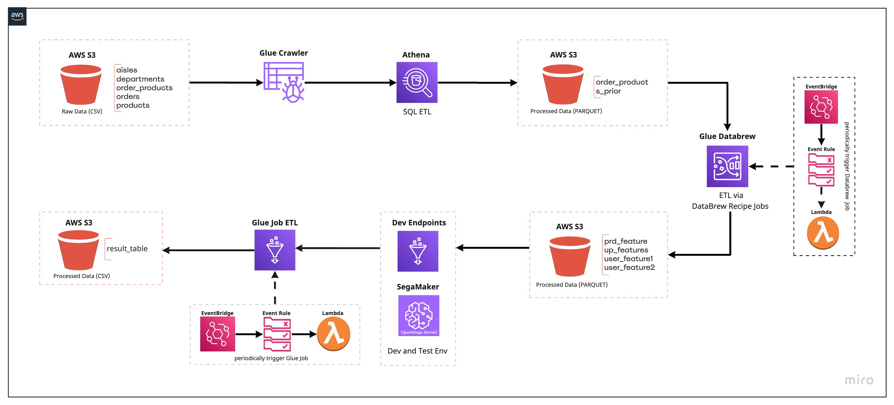
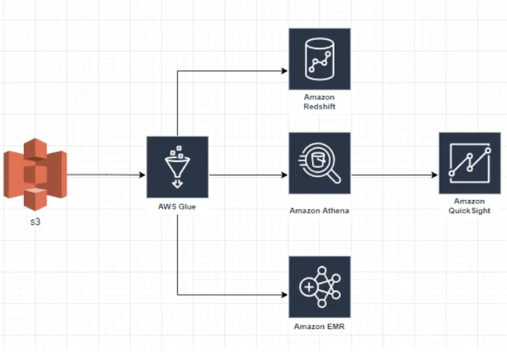

# AWS Data Pipeline for an Online Grocery Shopping Website

### Target
1. Build a data pipeline for an online order processing system based on a series of services of AWS to execute data ETL.
2. Build a ML model to explore the data insight and predict users activities.   

### Data Source

[3 Million Instacart Orders](https://tech.instacart.com/3-million-instacart-orders-open-sourced-d40d29ead6f2)

### Services Used
- AWS S3
- AWS Glue Crawler
- AWS Glue Catalog
- AWS Glue Databrew
- AWS Glue ETL Job
- AWS Athena

### Project Archtiecture
High level architecture of our ETL data pipeline

### Steps
1. **Build the Data Lake**
    
    After we have the cvs source data, we need to build a data lake and load the input into it. We can use the HDFS, NoSQL or Object Store. Here, we use the AWS S3 to store the raw data. AWS S3 is an object storage which has a good compatibility with other Big Data AWS services. AWS Glue is a serverless AWS service for data acquistion and ETL. Here, we run AWS Glue Crawler to automatically discovery table definitions and schemas from the data source.

    

2. **Query the data through Athena**

    After the data is cataloged by Glue Crawler, we can use Athena to execuate the SQL statements to query the specific data. The transformed data will be stored into a new S3 bucket for the next processing. The files are also partitioned and converted into Parquet format to optimize performance and cost.  
    e.g. _Query data from products, limit 10_  

    

3. **ELT in Glue DataBrew**  
    The high level of the usage of Glue DataBrew to explore data with a serverless self-service visual data preparation.  

    

    Refer to [Section 3](section_3) and [Section 4](section_4)

4. **Automatic Glue Job**  

    High levels of the automated Glue Job pipeline are as follows:

    1. Create target Lambda functions after the AWS DataBrew Project and AWS Glue Job script completion.
    2. Schedule AWS Lambda functions using AWS EventBridge, which will periodically trigger Lambda functions to run Glue Job automatically.  

    The sturcture contains two:
    - Scheduled Based
    - Trigger Based

    Refer to [Section 5](section_5)

5. **Machine Learning Model**

6. **Model Deployment**

7. **Results**